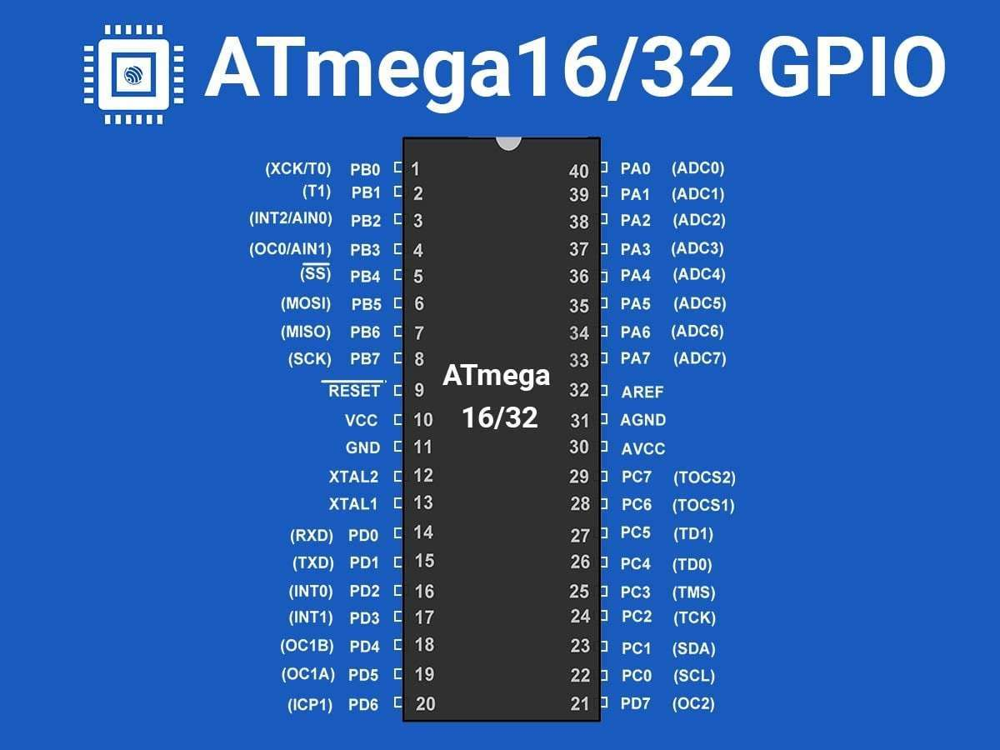

# NTI Intensive Training Round-4 ATMEGA Course

Welcome to this repository!

Here you will find all the files related to the ATMEGA Microcontroller course given by the NTI
You will find here the driver implementations, app coding, tasks, and projects.

  

## Author: Hossam Mahmoud
 
